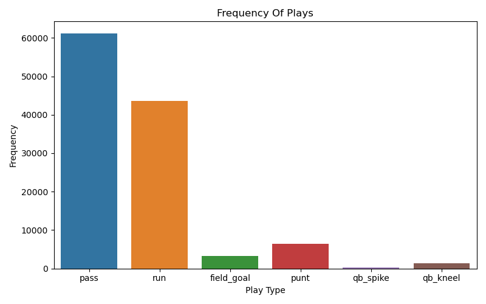
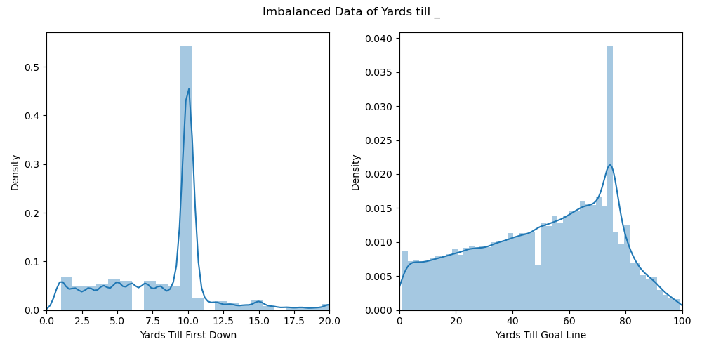
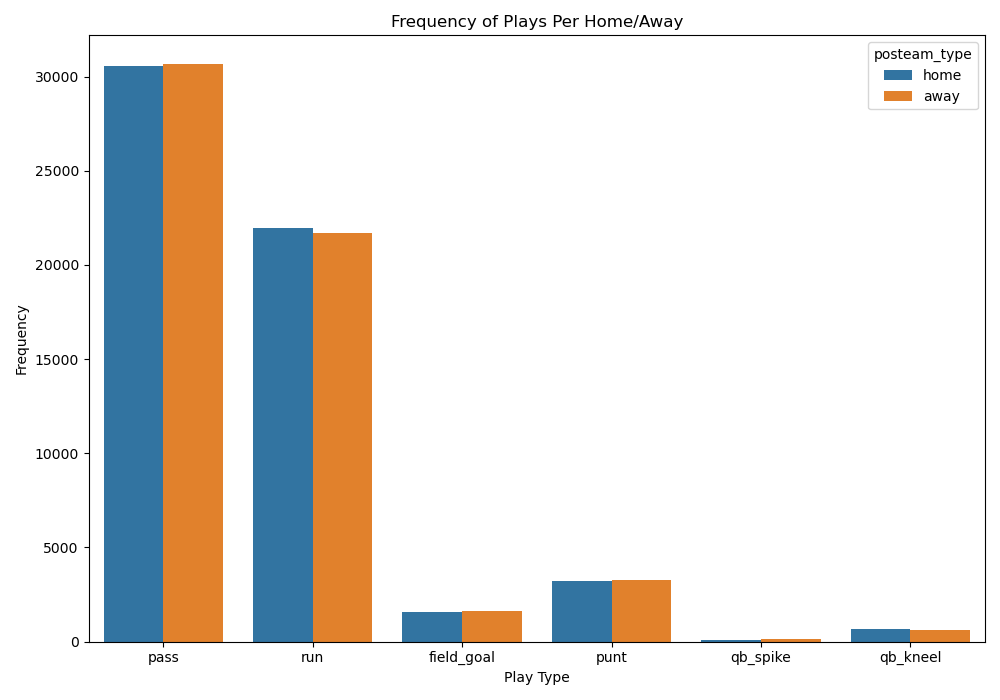
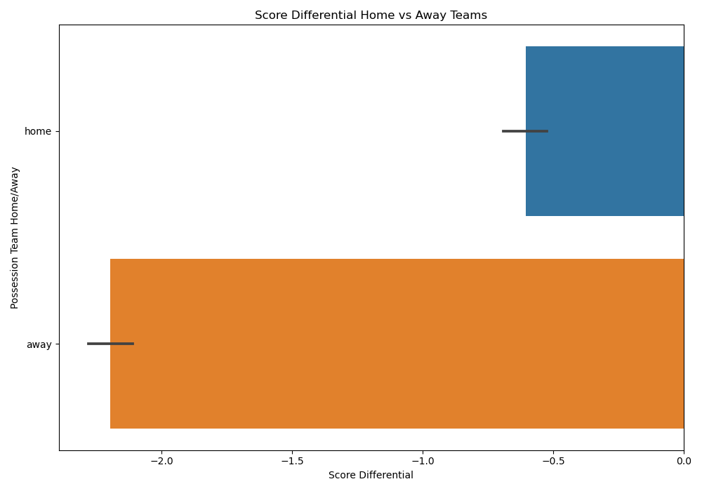
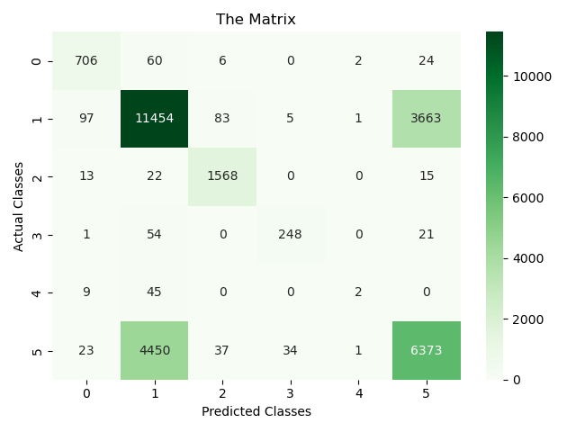

# NFLPlayPredictor

## Problem
A defensive coordinator gave our company a task of predicting what a play would be given the conditions at a specific point of a game. His team provided us a dataset of plays in the NFL for the past three years.

## Problem Statement
Create a predictive model that can predict the play type of an NFL play. Create an application that can be given new data and give a prediction of the play.

## Executive Summary
* Transformed variables from categorical to numerical
* Implemented princple component analysis to reduce dimensionality
* Create a model for both an imbalanced and balanced dataset
* Looked at model evaluation through confusion matrix and ROC techniques

## Datasets
[2020 Play By Play](./data/play-by-play-2020.csv)

[2021 Play By Play](./data/play-by-play-2021.csv)

[2022 Play By Play](./data/play-by-play-2022.csv)

## Data Dictionary
|Feature|Type|Dataset|Description|
|---|---|---|---|
|posteam|object|play_by_play_2020.csv, play_by_play_2021.csv, play_by_play_2022.csv|Team in possession of the football|
|posteam_type|object|play_by_play_2020.csv, play_by_play_2021.csv, play_by_play_2022.csv|If the possessing team is home or away|
|defteam|object|play_by_play_2020.csv, play_by_play_2021.csv, play_by_play_2022.csv|Team defending|
|yardline_100|int|play_by_play_2020.csv, play_by_play_2021.csv, play_by_play_2022.csv|Yards until endzone for posteam|
|qtr|int|play_by_play_2020.csv, play_by_play_2021.csv, play_by_play_2022.csv|Quarter of football|
|qtr_seconds_remaining|int|play_by_play_2020.csv, play_by_play_2021.csv, play_by_play_2022.csv|Seconds left in Quarter|
|down|int|play_by_play_2020.csv, play_by_play_2021.csv, play_by_play_2022.csv|Current down of play|
|ydstogo|int|play_by_play_2020.csv, play_by_play_2021.csv, play_by_play_2022.csv|Yards till first down marker or end zone|
|posteam_score|int|play_by_play_2020.csv, play_by_play_2021.csv, play_by_play_2022.csv|Score of possession team|
|defteam_score|int|play_by_play_2020.csv, play_by_play_2021.csv, play_by_play_2022.csv|Score of defending team|
|score_differential|int|play_by_play_2020.csv, play_by_play_2021.csv, play_by_play_2022.csv|Possession team score minus Defending team score|
|play_type|object|play_by_play_2020.csv, play_by_play_2021.csv, play_by_play_2022.csv|If the play is a run,pass,field goal,punt, qb spike, qb kneel|

## Findings

## Evaluations

## Conclusions/ Future Steps
* Our Xgboost model achieved an accuracy of 70%, which is 18% better than our baseline accuracy.
* Our model had difficulty classifying the pass and run play most likely due to the randomness of the NFL/ how past plays affect the next play/etc. However it also had difficulty classifying qb spikes, because those are dependent on time outs a team has and if the clock is still running, which are features we do not have in our dataset.
* Create a model where imbalanced data replacement techniques were implemented
* Look for more data where more features are available, eg: Formation of offense, weather of the day.

